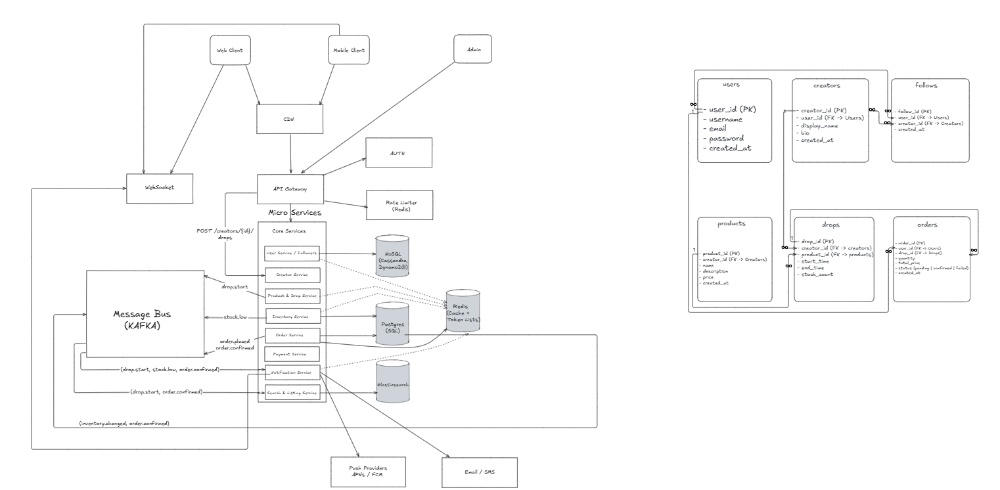

# LiveDrops — Flash-Sale & Follow Platform

## 📌 Overview
LiveDrops is a system where creators can run limited-inventory live product drops.  
Users can follow creators, receive near real-time notifications when drops start or stock changes, browse products, and place secure orders without overselling.  

This design prioritizes **scalability**, **low-latency reads**, and **idempotent order handling** to handle sudden traffic spikes from popular creators.

---

## 🖼️ Architecture Diagram

*(Diagram exported from [Excalidraw](./LiveDrops-Architecture.excalidraw))*  

---

## 🗂️ Data Model Sketches

### Users & Follows
- **Users**
  - `user_id (PK)`
  - `name`
  - `email`
- **Follows**
  - `follower_id (FK → Users.user_id)`
  - `creator_id (FK → Users.user_id)`
  - Composite PK → (`follower_id`, `creator_id`)

### Creators & Drops
- **Creators**
  - `creator_id (PK)`
  - `profile_name`
- **Drops**
  - `drop_id (PK)`
  - `creator_id (FK → Creators.creator_id)`
  - `product_id (FK → Products.product_id)`
  - `start_time`, `end_time`
  - `stock_count`

### Products & Orders
- **Products**
  - `product_id (PK)`
  - `title`, `description`, `price`
- **Orders**
  - `order_id (PK)`
  - `user_id (FK → Users.user_id)`
  - `drop_id (FK → Drops.drop_id)`
  - `status` (pending, confirmed, failed)
  - `created_at`
  - `idempotency_key` (to prevent duplicates)

---

## 📡 API Contract Outline

### Public API (for mobile/web clients)
- **User / Follow**
  - `POST /users/{id}/follow/{creatorId}`
  - `DELETE /users/{id}/follow/{creatorId}`
  - `GET /users/{id}/following`
  - `GET /creators/{id}/followers`
- **Products / Drops**
  - `GET /products?page=n`
  - `GET /drops/live`
  - `GET /drops/{id}`
- **Orders**
  - `POST /orders`  
    Request includes `drop_id`, `quantity`, `idempotency_key`
  - `GET /orders/{id}`

### Internal APIs / Events
- `drop.started`, `drop.soldout`, `stock.low`, `order.confirmed` → published via **Kafka**.  
- **Notification workers** consume these events to send push notifications in near real time.

---

## ⚡ Caching & Invalidation
- **Redis** used for:
  - Hot product details, stock counts, and creator profiles.
  - Paginated follower lists (sharded to avoid hot-spotting on celebrity creators).
- **Invalidation Strategy**:
  - On stock update or order confirmation → update DB (source of truth), then invalidate Redis cache entry.
  - Write-through cache for product reads.
  - Event-driven invalidation for follower updates.

---

## 🔑 Key Design Decisions & Tradeoffs
- **SQL for Orders & Inventory**  
  Ensures strong consistency and no overselling. Inventory updates use row-level locking or atomic counters.  

- **NoSQL for Follows (sharded by creator_id)**  
  Enables fast fan-out for large celebrity accounts with millions of followers.  

- **Kafka for Event Distribution**  
  Decouples drop/stock/order events from notification delivery and analytics.  

- **Idempotent Orders**  
  `idempotency_key` prevents double orders from retries.  

- **Scalability**  
  - Horizontally scalable stateless API servers behind load balancer.  
  - CDN for static content.  
  - Caching layer reduces DB load.  

- **Reliability**  
  - Notifications guaranteed via retry queues.  
  - Orders never oversell via DB-level constraints.  
  - System resilient to single-node failures.  

---

## 📊 Metrics & Observability
- Track **request volume, latency (p95)**, **cache hit ratio**, **DB lock contention**, **notification delivery times**.  
- Centralized logging and monitoring dashboards (Grafana/Prometheus).  

---

## ✅ Requirements Checklist
- [x] Follows, unfollows, follower list queries  
- [x] Product browsing with pagination  
- [x] Live drop scheduling, stock enforcement  
- [x] Real-time notifications (< 2s)  
- [x] Orders with idempotency and no overselling  
- [x] Low-latency reads (p95 ≤200ms)  
- [x] Order placement ≤500ms  
- [x] Scalability to millions of followers  

---

## 🚀 How to Run
This repo contains:
- `LiveDrops-Architecture.excalidraw` (editable diagram)  
- `LiveDrops-Architecture.png` (export for quick viewing)  
- `README.md` (this document)  

---
